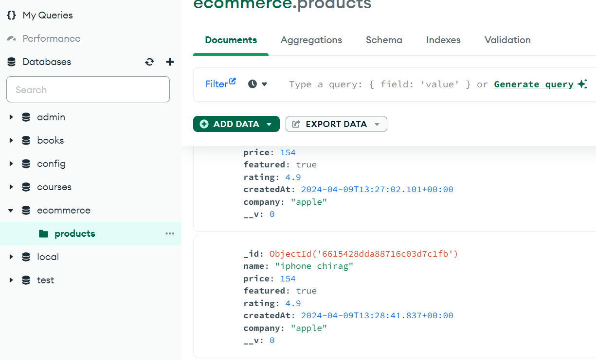

# REST API


Building a rest API


1. importing packages
2. express
3. nodemon
4. listening to server
# **Setting up routes **
1. router- controller
2. Routes - is responsible for which path we should follow and where i should reach 
3. Controller :  Is responsible for after reaching what next,perform the task     
**STEPS:**

# step 1 :Two Folder under Project
1. controller
2. routes


# step 2:`` under the route folder in the products.js file
```
const express = require("express");
const router = express.Router();

// import what function you are passing 
const {getAllPrducts,getAllPrductsTesting} = require("../controller/products");
```


```
// avg mehtod
router.get("/all", (req,res)=>{
    res.json({msg: "welcome"})
});

router.get("/testing", (req, res)=>{
    res.json({msg: "Testing"})
});
```
```
// Better method
router.get("/products",getAllPrducts) 
router.get("/productstesting",getAllPrductsTesting)
```
```
// exporting the routes are very important
module.exports = router;
```
# step 2:`` under controller folder in the products.js file
```

// Defing our function 
const  getAllPrducts = async (req, res) => {
    res.json({msg: "all products"})
}
```
```
// Defining our function 
const getAllPrductsTesting = async (req, res)=>{
    res.json({msg: "all products"})
};
```


```
// export this function are very important  
module.exports = {
 getAllPrducts,
 getAllPrductsTesting
} 
```
# step 2:`` under app.js file ( Main Entry point of the app) 
```
// import the routes folder
const products_routes = require("./routes/products")
```
```
// use middlewae to navigate 
app.use("/api/products", products_routes)
```


---

# Testing API using Postman & Thunderbolt


# Introduction to MongoDB & Mongoose || Connect Backend to Database


**Create a  Folder DB**


STEP 1 : install mongoose and perform given task

```
npm i mongoose
const mongoose = require("mongoose")

URI ="mongodb_url"
const connectDB = ()=>{
    console.log("db connected");

    return mongoose.connect(URI)
}
// or
mongoose.connect(URI)

module.exports = connectDB
```
`` 


In app.js file

```
const connectDB = require("./db/connect")


// or call the funcion 
app.listen(PORT, ()=>{
connectDB() }
)
```


#  Secure Your Personal Data with DOTENV
```
npm i mongoose
```
create an a.env file and add it in the .gitignore file

```
// import he dotenv package
require("dotenv").config()
```
```
// This command either will access the value of PORT from .env file
// 0r
// if something goes wrong it willl access the given value i.e : 3000 
 
const PORT = process.env.PORT || 3000
```
```
.env file
PORT = XXXX
DATABASE_URL = mongoose://something:/string/url/appname
```
```
process.env.DATABASE_URL
```
# Create Schema & Model (Collection & Tables) using Mongoose & Express JS


1. create a model folder > product.js
2.  We just need to Define the schema and export it 


**Defining**`****`** schema **

```
const mongoose = require("mongoose")
const productSchema = new mongoose.Schema({
    name: {
        type : String,
        required:[true, "Name should be provided"],
    },
    price :{
        type:Number,
        required:[true, "Price must be provided"],
    },
    featured :{
        type : Boolean,
        default :false,
    },
    rating:{
        type:Number,
        default: 4.9,
        required:[true, "Rating  must be provided"],
    },

    createdAt:{
        type: Date,
        default :Date.now()
    },
    company :{
        type :String,
        // here enums are validating the company : only the given company are allowed
        enum:{
            values:["Apple", "Samsung", "Dell", "MI"],
            message:`${value} is not supported`
        }
    }
})
```
```
 // now add this in my Databse collection 
// creae new collection 


module.exports = mongoose.model("Product", productSchema)
```
**Till now it's empty  : It should have a collection with name : eccomerce**


#### Stored API data (JSON) in a Database using Express & Mongoose 
 it means - the collection should be MongoDB and we can feed some data to this collection 


This is something different approach to create a schema and dumped the JSON Data in one go

In the Root Project

created products.json file 

```
[
  {
    "name": "iphone",
    "price": 154,
    "featured": true,
    "company": "apple"
  },
  {
    "name": "iphone10",
    "price": 1154,
    "featured": true,
    "company": "apple"
  },
  {
    "name": "watch",
    "price": 204,
    "company": "apple"
  },
  {
    "name": "watch10",
    "price": 304,
    "company": "apple"
  },
  {
    "name": "s20",
    "price": 404,
    "company": "samsung"
  },
  {
    "name": "s20",
    "price": 505,
    "company": "samsung"
  },
  {
    "name": "dell gaming",
    "price": 501,
    "company": "dell"
  },
  {
    "name": "mi20",
    "price": 701,
    "company": "mi"
  }
]
```
And then just to dump these data directly, we use

```
// create productDb.js
```
```
// import the dependicies
require("dotenv").config()
const express = require("express")
const app = express()
const connectDB = require("./db/connect")
const Product = require("./models/product")

// This is important
const ProductJson = require("./products.json")
```
```
app.listen(process.env.PORT , async ()=>{
    await connectDB(process.env.DATABASE_URL)
    //  just pass the variable who is holding whole json file
    await Product.create(ProductJson)
    console.log("success fully conected");
    console.log("server is running..");
})
```


# **After learning these and alll**


**create a new route **

```
// in route > product.js
router.post("/addproduct",createProduct)
```
```
// now this createProduct from **TOP**
const createProduct = async (req, res)=>{
    console.log("i am here ... ");
    await Product.create({
        name: req.body.name,
        price: req.body.price,
        featured: req.body.featured,
        rating: req.body.rating,
        createdAt: req.body.createdAt,
        company: req.body.company
    })
    console.log("i am done , check now ");
    res.status(201).json({
        msg: "Product created"
    })
}
```


## See the Database Log

# Read Data from Database using Express & Mongoose


